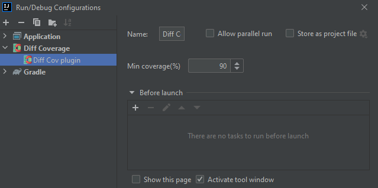
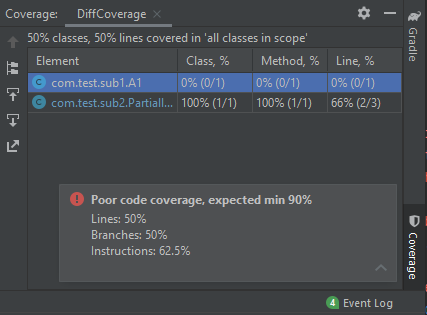
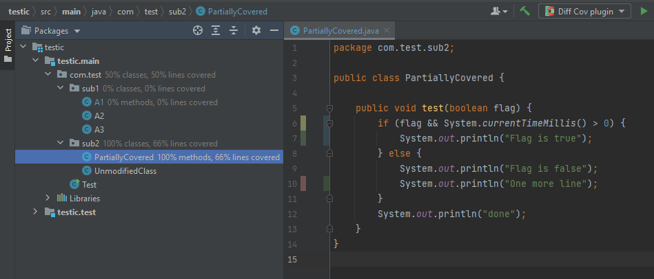

# diff-coverage-idea-plugin

## Installation

- Using IDE built-in plugin system:

  <kbd>Preferences</kbd> > <kbd>Plugins</kbd> > <kbd>Marketplace</kbd> > <kbd>Search for "diff-coverage-idea-plugin"</kbd> >
  <kbd>Install Plugin</kbd>

- Manually:

  Download the [latest release](https://github.com/SurpSG/diff-coverage-idea-plugin/releases/latest) and install it manually using
  <kbd>Preferences</kbd> > <kbd>Plugins</kbd> > <kbd>⚙️</kbd> > <kbd>Install plugin from disk...</kbd>

## How to use
* Create or open gradle project
* Apply and setup [DiffCoverage Gradle plugin](https://github.com/form-com/diff-coverage-gradle)
* Make some changes to your code and run tests to collect coverage info
* Set up Diff Coverage run configuration
  
  

<!-- Plugin description -->

<!-- Plugin description end -->

## How it works
Diff coverage IDEA plugin:
* detects a module to which [DiffCoverage Gradle plugin](https://github.com/form-com/diff-coverage-gradle) is applied and collects settings
* Analyzes coverage of uncommited code
* Displays coverage panel for uncommited code and shows a balloon with coverage stats
* Displays coverage for uncommited code in the project view and in code editor

  
  
